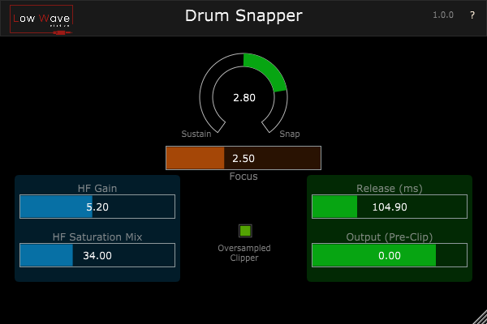

# DrumSnapper
Transient Shaper with some extra features

Drum Snapper is a Transient Shaper tailored for drums. It can add more snap or more sustain to the drums and has other extra functions not found on other transient shapers.

It has a Focus knob specially made for sharpening the attack of the drum;
A Tape-like Clipper that is oversampled to avoid aliasing (introduces latency, for best quality);
With the Release knob it is possible to shape the tail of the drum when adding sustain and change the sensitivity of the processing when adding attack;
A Tape-like Clipper for distorting high frequencies spikes, with both gain and mix controls. To add excitement.

Made using the JUCE framework

